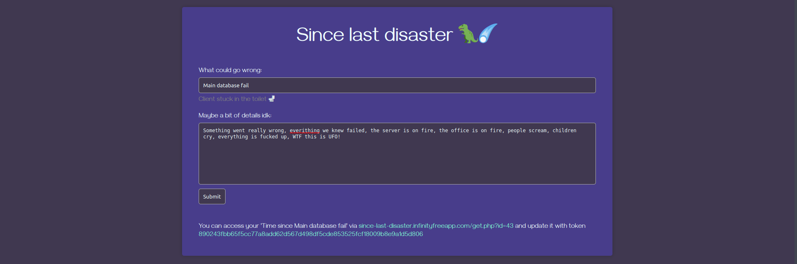
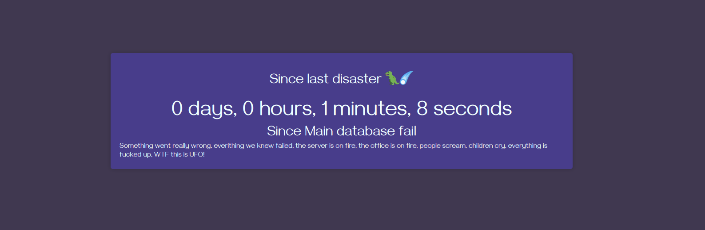

#  Since last disaster 🦖☄️ 
This is a fun project developed in several hours for cases, when you want to track some events like:
+ Since main database fall
+ Since we were DDOS attacked
+ Since customer stuck in a toilet

You know, like some things that happens. You don't need to host anything (of course if you don't want to), 
i already deployed this service and it available via [this link](http://since-last-disaster.infinityfreeapp.com/index.php)
You only need to describe what could go wrong and generate a link. 

After
you will have such link http://since-last-disaster.infinityfreeapp.com/get.php?id=43 that you can
share with your friends or co-workers to track time from some events 

and update this time in this event
by making GET request to http://since-last-disaster.infinityfreeapp.com/update.php?updateToken=<token>,
updateToken you are getting right next to shared link. You can include this request via CURL to
your CI/CD pipeline and automate this process. 